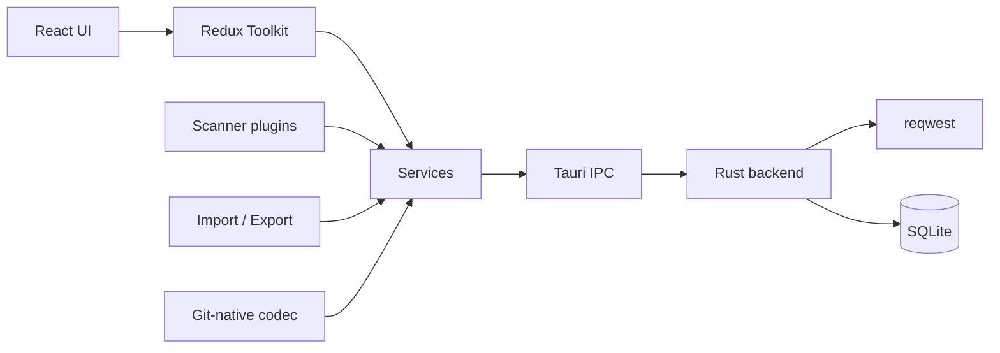

# Fishman

**A native, Git-first API client for developers who care about speed, privacy, and flow.**

Fishman is an open-source desktop API client built with **Rust**, **Tauri v2**, **React**, and **TypeScript**. It combines a focused request workspace with local-first storage and optional Git-native collections that live next to your code.

No Electron bloat. No cloud lock-in. Your requests, history, and secrets stay on your machine unless you export or commit them.

[Features](#features) · [Install](#installation) · [Development](#development-setup) · [Docs](#architecture-overview) · [Contributing](#contributing)

---

## Badges

[](https://github.com/nkrider7/fishman/actions/workflows/ci.yml)
[](https://github.com/nkrider7/fishman/actions/workflows/release.yml)
[](LICENSE)
[](https://github.com/nkrider7/fishman/releases/latest)
[](https://github.com/nkrider7/fishman)

---

## Support

If Fishman helps your workflow, you can support development on Ko-fi:

<div align="center">
  <a href="https://ko-fi.com/B6E223SE98" target="_blank" rel="noopener noreferrer">
    
  </a>
</div>

Sponsorship never gates features — Fishman stays open source and free to use.

---

## Features

| Area | What you get |
|------|----------------|
| **REST** | Full method set including HTTP `QUERY`, rich body types, auth, code gen |
| **GraphQL** | Query / variables / operation name, introspection docs, data & errors view |
| **WebSocket** | Connect / disconnect, live timeline, Text / JSON / Binary composer |
| **Git-native** | Collections as `*.fish` JSON in your repo — branch, review, and merge |
| **Scanner** | Point at a codebase (or GitHub URL) and generate a collection |
| **Privacy** | Local SQLite + optional filesystem workspace; nothing synced by default |
| **Native** | HTTP via Rust `reqwest`; small Tauri shell instead of Chromium-as-app |

**Highlights**

- Multi-tab workspace with pin, unsaved indicators, and keyboard shortcuts
- Environments with `{{variable}}` substitution and live scope hints
- Import / export Postman and Fishman formats
- **Find & Replace URLs** — sidebar panel (VS Code–style); select text + `Ctrl/Cmd+Shift+H`
- Workspaces, cookies manager, history, themes (light / dark / system)
- Plugin-oriented scanner and import-export layers

---

## Screenshots

> Screenshots coming soon. Place product images under `docs/images/` and link them here.

```text
docs/images/
  overview.png
  request-builder.png
  git-native.png
```

<!--


-->

---

## Installation

### Download binaries

Installers are published on [GitHub Releases](https://github.com/nkrider7/fishman/releases).

| Platform | Artifact | Notes |
|----------|----------|--------|
| Linux | `.AppImage` | `chmod +x` then run |
| Linux | `.deb` | Ubuntu / Debian |
| Windows | NSIS `*-setup.exe` | Recommended for most users |
| Windows | `.msi` | Silent / IT install |

macOS builds are not yet in the default release pipeline.

### From source

```bash
git clone https://github.com/nkrider7/fishman.git
cd fishman
npm install
npm run tauri build
```

See [Development setup](#development-setup) for prerequisites.

---

## Development setup

### Requirements

| Tool | Version |
|------|---------|
| Node.js | 20+ (22 LTS recommended) |
| Rust | Stable (via rustup) |
| Platform deps | [Tauri prerequisites](https://tauri.app/start/prerequisites/) |

**Ubuntu / Debian**

```bash
sudo apt install libwebkit2gtk-4.1-dev build-essential curl wget file \
  libssl-dev libayatana-appindicator3-dev librsvg2-dev
```

### Running locally

```bash
npm install
npm run tauri dev    # full desktop app
npm test             # unit tests
npm run tauri build  # production installers
```

Quick smoke test after launch:

- `GET https://httpbin.org/get`
- `POST https://httpbin.org/post` with body `{"hello":"world"}`

---

## Project structure

```text
fishman/
├── src/                 # React frontend
│   ├── app/             # App shell & providers
│   ├── components/      # Feature UI
│   ├── store/           # Redux Toolkit
│   ├── services/        # DB, environments, orchestration
│   ├── scanner/         # Code → collection plugins
│   ├── import-export/   # Format plugins
│   ├── git-native/      # Filesystem / Git workspace codec
│   ├── tauri/           # Typed invoke wrappers
│   └── types/           # Shared TypeScript models
├── src-tauri/           # Rust backend (HTTP, SQLite, IPC)
├── docs/                # Architecture, roadmap, community docs
├── .github/             # CI, templates, Dependabot
└── public/              # Static assets
```

---

## Supported APIs

### REST

- Methods: `GET`, `QUERY`, `POST`, `PUT`, `PATCH`, `DELETE`, `HEAD`, `OPTIONS`, `TRACE`, `CONNECT`
- Bodies: JSON, form-data, `x-www-form-urlencoded`, raw, XML, HTML, GraphQL, binary
- Auth: Bearer, Basic, API Key, JWT, OAuth2 token, custom header
- Code snippets: cURL, HTTPie, fetch, axios, Python requests, and more

### GraphQL

- Query / Variables / Operation Name editors
- Schema introspection and docs sidebar
- GraphQL data and errors response view
- Subscriptions planned over the WebSocket client

### WebSocket

- `ws://` and `wss://` connections
- Handshake headers and auth
- Live message timeline with filters
- Text / JSON / Binary composer and saved templates
- `{{variable}}` support

---

## Git-native collections

Store APIs next to your source — commit, branch, and review like code.

```text
project/
└── fishman/
    ├── workspace.json
    ├── environments/
    │   ├── local.json
    │   └── local.secret.json   # gitignored
    └── collections/
        └── Auth/Login.fish
```

- Deterministic JSON for clean diffs
- Secrets stay in `*.secret.json`
- File watcher + conflict UI (ours / theirs)
- Details: [docs/git-native.md](docs/git-native.md)

---

## Environment variables

| Scope | Behavior |
|-------|----------|
| Global | Shared across collections in a workspace |
| Collection | Scoped to one collection |
| Secrets | Prefer secret files / gitignored storage |

Use `{{variable}}` in URLs, headers, params, body, auth, and WebSocket fields. Variable-aware inputs show live scope hints.

---

## Roadmap

High-level plan: [docs/roadmap.md](docs/roadmap.md).

| Status | Themes |
|--------|--------|
| In progress | WebSocket polish, scanner coverage, Git UX |
| Planned | OpenAPI / Bruno / Insomnia import, macOS releases, GraphQL subscriptions |
| Ideas | Collections sharing, richer docs export, more language scanners |

---

## Contributing

We welcome issues, discussions, and pull requests.

1. Read [CONTRIBUTING.md](CONTRIBUTING.md)
2. Follow the [Code of Conduct](CODE_OF_CONDUCT.md)
3. Use issue forms for bugs, features, and docs

For large features, open a Discussion first so we can align on design.

---

## Security

Please report vulnerabilities privately — see [SECURITY.md](SECURITY.md).

Do not file public issues for security-sensitive reports.

---

## License

Licensed under the [Apache License, Version 2.0](LICENSE).

```text
Copyright 2026 Narendra Nishad
```

See also [NOTICE](NOTICE) for attribution and third-party notices.

---

## Trademark

"Fishman", the Fishman logo, and related branding are trademarks of Narendra Nishad.

The Apache-2.0 license applies to the source code only. It does not grant permission to use the Fishman name, logo, or branding for derivative products in a way that implies endorsement or official affiliation.

See [docs/branding.md](docs/branding.md).

---

## Credits

- Built on [Tauri](https://tauri.app/), [React](https://react.dev/), [Vite](https://vitejs.dev/), and the Rust ecosystem
- UI primitives inspired by [shadcn/ui](https://ui.shadcn.com/) and [Radix](https://www.radix-ui.com/)
- Inspired by the developer experience of tools like Bruno, Insomnia, and VS Code

---

## Community

| Channel | Purpose |
|---------|---------|
| [GitHub Issues](https://github.com/nkrider7/fishman/issues) | Bugs and actionable tasks |
| [GitHub Discussions](https://github.com/nkrider7/fishman/discussions) | Ideas, Q&A, show and tell |
| [Ko-fi](https://ko-fi.com/B6E223SE98) | Support development |
| Discord | Coming soon — placeholder in [docs/community.md](docs/community.md) |

Suggested Discussion categories once enabled:

- **Announcements** — releases and project news
- **Q&A** — help using Fishman
- **Ideas** — feature proposals
- **Show and tell** — scanners, themes, workflows
- **Development** — contributing and architecture

---

## FAQ

**Is Fishman free?**  
Yes. The source is Apache-2.0. You can use, modify, and distribute the code under that license.

**Does it require an account or cloud?**  
No. Data is local by default.

**Can I sync collections with Git?**  
Yes — use Git-native workspaces under a `fishman/` folder in your project.

**Why Tauri instead of Electron?**  
Smaller footprint and native Rust HTTP without shipping a full Chromium app shell.

**Where do I download builds?**  
[GitHub Releases](https://github.com/nkrider7/fishman/releases).

---

## Architecture overview



Deep dive: [docs/architecture.md](docs/architecture.md)

---

## Performance

- HTTP executed in Rust (`reqwest`), not the webview network stack
- Local SQLite for app state; optional filesystem for Git-native collections
- Small splash assets and deferred window show for faster perceived startup
- Virtualized lists for large workspaces where applicable

---

## Future plans

See [docs/roadmap.md](docs/roadmap.md) and [docs/philosophy.md](docs/philosophy.md).

Priorities include broader import formats, macOS packaging, GraphQL subscriptions, and deeper Git workflows — without sacrificing local-first privacy.

---

## Keyboard shortcuts

| Shortcut | Action |
|----------|--------|
| `Ctrl` / `⌘` + `Enter` | Send request |
| `Ctrl` / `⌘` + `S` | Save active request |
| `Ctrl` / `⌘` + `N` | New request tab |
| `Ctrl` / `⌘` + `W` | Close active tab |

---

## Suggested GitHub topics

When configuring the repository on GitHub, add:

`tauri` · `rust` · `react` · `typescript` · `api-client` · `graphql` · `rest` · `websocket` · `developer-tools` · `open-source` · `desktop` · `git`

---

<p align="center">
  <strong>Fishman</strong> — open a request. Hit send. Stay in flow.
</p>
