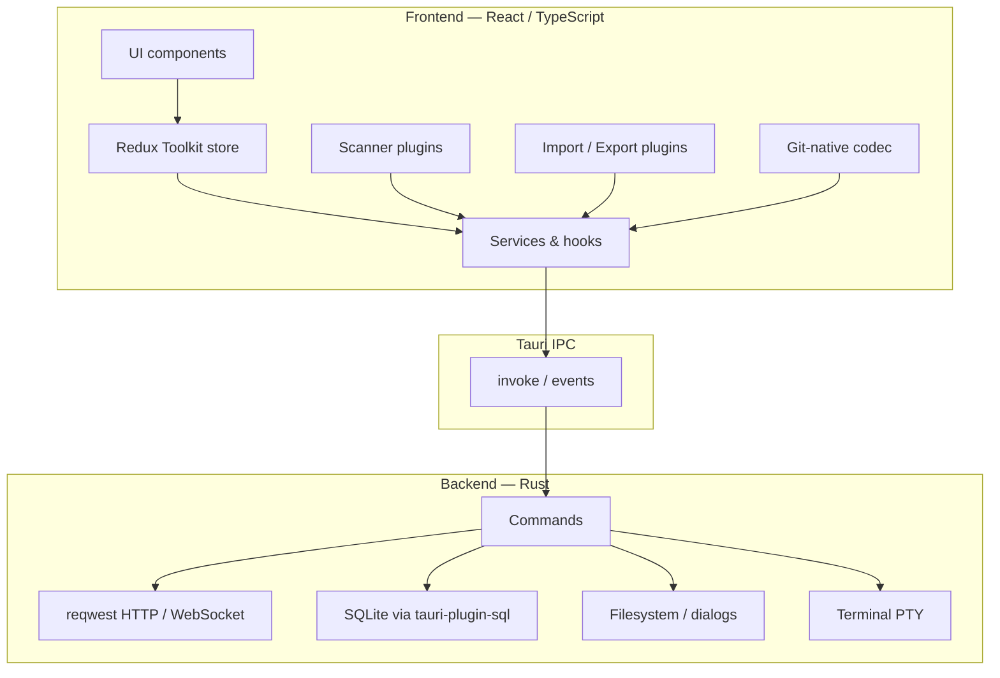

# Architecture

Fishman is a Tauri v2 desktop application with a React/TypeScript frontend and a
Rust backend. The frontend owns UX and state; the backend owns networking,
persistence, and privileged OS access.

## High-level diagram

## Frontend

| Area | Location | Responsibility |
|------|----------|----------------|
| App shell | `src/app/` | Layout, providers, top-level wiring |
| Components | `src/components/` | Feature UI (request, response, collections, WS, tools) |
| State | `src/store/` | Slices, thunks, selectors |
| Services | `src/services/` | Orchestration over DB / IPC |
| Types | `src/types/` | Shared domain models |
| Tauri wrappers | `src/tauri/` | Typed `invoke` helpers |

UI stack: React 19, Vite, Tailwind CSS v4, shadcn/ui-style Radix primitives,
Monaco Editor, Redux Toolkit.

## Rust backend

| Area | Location | Responsibility |
|------|----------|----------------|
| Library / commands | `src-tauri/src/` | IPC command surface |
| HTTP client | Rust `reqwest` | REST requests |
| WebSocket | `tokio-tungstenite` | WS sessions |
| Migrations | `src-tauri/migrations/` | SQLite schema evolution |
| Terminal | PTY integration | Tools panel terminal |

The webview does not send application HTTP requests directly; Rust executes them
and returns structured responses to the UI.

## IPC

- Frontend calls typed wrappers in `src/tauri/`
- Backend exposes Tauri commands registered from `src-tauri/src/lib.rs`
- Events may stream progress (e.g. WebSocket messages, terminal output)

Capabilities and permissions are declared in Tauri config — keep the surface
minimal when adding new filesystem or network access.

## Database

- SQLite via `tauri-plugin-sql`
- Stores app settings, history, cookies, and traditional collection data
- Schema changes go through numbered migrations under `src-tauri/migrations/`

Git-native workspaces are **not** the primary SQLite store; they live on disk as
JSON under a project’s `fishman/` folder.

## Git integration

- Codec and document schema under `src/git-native/`
- Pretty, deterministic JSON (`*.fish`) for clean diffs
- Secrets in `*.secret.json` (gitignored)
- Watcher syncs external edits; unsaved drafts are protected
- Git status / branch / conflict UI for workspace files

See [git-native.md](git-native.md).

## Plugin system

Two extension axes are designed for growth without core rewrites:

1. **Scanner plugins** (`src/scanner/`) — detect frameworks and extract routes
2. **Import / export plugins** (`src/import-export/`) — Postman, Fishman, docs HTML, …

New formats and languages should follow existing plugin patterns rather than
special-casing the app shell.

## Future architecture

- Stronger capability isolation and clearer module boundaries for WS / GraphQL
- Optional shared schema between SQLite and Git-native documents
- Expanded plugin APIs for community scanners and importers
- Packaging targets beyond Linux/Windows (macOS) with signing

Related docs: [philosophy.md](philosophy.md), [roadmap.md](roadmap.md),
[code-style.md](code-style.md).
